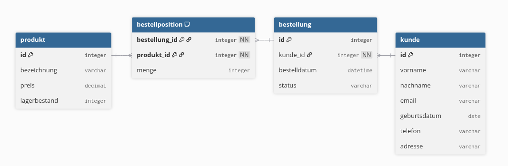

## Aufgabe

Ein Onlineshop hat das folgende Datenmodell:



## 1. Datenbank erstellen

Erstelle die Datenbank anhand des vorgegebenen Datenmodells.
Verwende die Tabellen:

- `kunde`
- `produkt`
- `bestellung`
- `bestellposition`

Achte auf Primär- und Fremdschlüssel sowie die im Datenmodell vorgegebenen Beziehungen.

## 2. Datenbank mit Testdaten befüllen

Schreibe eine `seed.py`, welche die Datenbank mit zufällig erzeugten Testdaten befüllt.

Die Datengrundlage und die Wertebereiche müssen im vorgegebenen Code enthalten sein (die Verwendung der faker-lib ist an dieser Stelle als ausgeschlossen).

Verwende weiters einen festen Random Seed, sodass bei jedem Programmlauf dieselben Daten erzeugt werden.

Verwende folgende Tabellengrößen:

|Tabelle|Anzahl|
|---|--:|
|`produkt`|10.000|
|`bestellposition`|500.000|
|`bestellung`|100.000|
|`kunde`|10.000|
Die erzeugten Daten sollen realistisch genug sein, um sinnvolle SQL-Abfragen und Performance-Messungen zu ermöglichen.

## 3. View für eine vereinfachte Sicht

Erstelle eine View, welche Informationen aus der Tabelle `kunde` bereitstellt, ohne sämtliche gespeicherten Kundendaten sichtbar zu machen.

Die View soll beispielsweise nur folgende Informationen enthalten:

- Kundennummer
- Vorname
- Nachname
- E-Mail-Adresse

Überlege, welchen Vorteil eine solche View gegenüber einem direkten Zugriff auf die Tabelle haben kann.

## 4. View mit zusammengefassten Daten

Erstelle eine View, welche den **Gesamtwert jeder Bestellung** berechnet.

Die View soll zumindest folgende Informationen liefern:

- Bestellnummer
- Kundennummer
- Gesamtwert der Bestellung

Verwende dazu die Tabellen `bestellung`, `bestellposition` und `produkt`.

Der Gesamtwert einer Bestellung ergibt sich aus:

```
Menge × Preis
```

für alle Positionen der jeweiligen Bestellung.

## 5. View als vereinfachte Schnittstelle

Erstelle eine weitere View, welche Informationen aus mehreren Tabellen so zusammenfasst, dass eine häufig benötigte Abfrage einfacher wird.

Die View soll für jede Bestellung zumindest folgende Informationen liefern:

- Bestellnummer
- Kundennummer
- Bestelldatum
- Bestellstatus
- Vorname und Nachname des Kunden

Überlege dir anschließend eine konkrete Abfrage, bei der diese View die eigentliche SQL-Abfrage deutlich übersichtlicher macht.

# 6. Views und Performance

Views können SQL-Abfragen erheblich vereinfachen. Dadurch entsteht allerdings ein Problem:

> **Die Komplexität, die innerhalb einer View steckt, ist bei der Verwendung der View nicht mehr sichtbar.**

Dadurch können zwei Views von außen völlig gleich aussehen, intern aber unterschiedlich aufwendig implementiert sein.

Für diese Aufgabe erhältst du zwei **semantisch identische SQL-Abfragen**, die die jeweils letzten Bestellungen der Kunden zeigen sollen. Für den Performancevergleich werden aus praktischen Gründen nur die ersten 10.000 Bestellungen betrachtet. Beide Views müssen diese Einschränkung identisch berücksichtigen.

**Variante A**

```
SELECT
    b.kunde_id,
    b.id AS bestellung_id,
    b.bestelldatum
FROM bestellung b
WHERE b.bestelldatum = (
    SELECT MAX(b2.bestelldatum)
    FROM bestellung b2
    WHERE b2.kunde_id = b.kunde_id
);
```

**Variante B**

```
SELECT
    b.kunde_id,
    b.id AS bestellung_id,
    b.bestelldatum
FROM bestellung b
JOIN (
    SELECT
        kunde_id,
        MAX(bestelldatum) AS bestelldatum
    FROM bestellung
    GROUP BY kunde_id
) letzte
    ON letzte.kunde_id = b.kunde_id
   AND letzte.bestelldatum = b.bestelldatum;
```

Beide Abfragen liefern dieselbe Information: die Bestellung(en) mit dem jeweils spätesten Bestelldatum jedes Kunden.

### Aufgabenstellung

1. Erstelle aus den beiden Abfragen die Views `letzte_bestellung_a` und `letzte_bestellung_b`.
2. Überprüfe zunächst, dass beide Views dieselben Ergebnisse liefern.
3. Schreibe eine `benchmark.py`, welche einen einfachen `SELECT` auf beide Views wiederholt ausführt.
    
    Verwende dazu das Python-Modul `timeit`.
    
    Beide Views sollen dabei **auf dieselbe Weise** abgefragt werden.
    
    Beispiel:
    
    ```
    SELECT *
    FROM letzte_bestellung_a
    WHERE kunde_id = 42;
    ```
    
    bzw.
    
    ```
    SELECT *
    FROM letzte_bestellung_b
    WHERE kunde_id = 42;
    ```
    
1. Führe jede Abfrage ausreichend oft aus, damit ein aussagekräftiger Durchschnittswert entsteht und bedenke, dass das Skript dabei potentiell lange laufen wird (einzelne Laufzeitmessungen der Selects im Vorfeld lassen Zeitschätzungen zu)
2. Ermittle, um welchen Faktor sich die Laufzeiten unterscheiden.

### Wichtig

**Untersuche zunächst nur die Laufzeit.**

Verwende zu diesem Zeitpunkt noch kein `EXPLAIN QUERY PLAN`.

Die Frage ist zunächst:

> **Kann man von außen erkennen, dass die beiden Views intern unterschiedlich effizient umgesetzt sind?**

Erst nachdem du die Laufzeiten untersucht hast, kannst du mit `EXPLAIN QUERY PLAN` untersuchen, **warum** sich die Laufzeiten unterscheiden.

# 7. Untersuchung und Report

Erstelle einen kurzen Report (ca. **½–1 Seite**), in dem du deine Ergebnisse dokumentierst.

Behandle dabei mindestens folgende Forschungsfragen:

### Views

- Welchen Zweck haben Views?
- Welche Vorteile bieten Views gegenüber dem direkten Zugriff auf Tabellen?
- Welche Nachteile bzw. Gefahren können entstehen?

### Performance

- Liefern die beiden Views tatsächlich dasselbe Ergebnis?
- Wie unterscheiden sich die gemessenen Laufzeiten?
- Warum ist es problematisch, dass die interne SQL-Abfrage einer View bei der Verwendung nicht unmittelbar sichtbar ist?
- Was zeigt `EXPLAIN QUERY PLAN` über die beiden Abfragen?
- Welche Unterschiede in der Verarbeitung erklären die gemessenen Laufzeiten?

### Schlussfolgerung

Formuliere abschließend eine kurze Antwort auf folgende Frage:

> **Kann eine View eine Abfrage vereinfachen, ohne dass dadurch die zugrunde liegende Komplexität und deren mögliche Auswirkungen auf die Performance verschwinden? Begründe deine Antwort anhand deiner Messungen.**

# Abgabe

Deine Abgabe enthält:

```
assignment/
├── model.sql
├── seed.py
├── views.sql
├── benchmark.py
└── report.md
```
